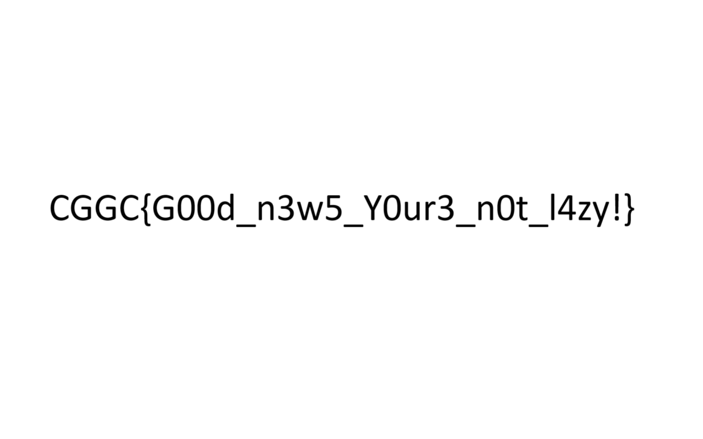

# My First Handwritten Note

This is a sample post that appears on the grid. It uses a handwritten font and has a specific position and size.

Some key features:
* Appears in a specific grid position
* Uses custom fonts
* Links to this full content

This could be a thought, idea, quote, or any short piece of content that you want to highlight on your grid.

You can connect this to other posts to create a visual relationship between ideas.

Here's an example image:

You can also use remote images:

